<!-- This is an html comment and this won't appear in the rendered page. You are now editing the "content" area, the core of your description. Everything that you can do in markdown is allowed below. We added a couple of comments to guide your through documenting your progress. -->

## About Me

Hi, I'm Sebastian Rodriguez, I'm from Colombia and currently a first year Master's student at Université de Montréal. I am passionate about neuroscience and machine learning. 


## Introduction/Background

Alzheimer's disease (AD) is characterized by pathological accumulation of amyloid plaques and tau neurofibrillary tangles in the brain. Tau PET is one of the most accurate methods to identify AD pathology currently, as it allows in vivo quantification of tau burden. However, it is very expensive, time-consuming, and not widely available in clinical settings. 

So, a model capable of predicting tau PET burden, or classifying tau positivity, from cheaper, more accessible measures (FDG-PET, amyloid PET, cognitive scores, genetics) would have significant clinical & research value.

This project is a complete and reproducible ML pipeline using data from the **Alzheimer's Disease Neuroimaging Initiative (ADNI)** to:
1. Predict tau PET SUVR as a continuous outcome
2. Predict tau positivity as a binary outcome (classify participants as tau-positive or tau-negative)
3. Identify which predictors drive model performance using SHAP explainability

The pipeline is fully open-source and designed for reproducibility: so anyone can clone this repository and run the full pipeline immediately using the included synthetic dataset that follows my real ADNI data distribution! :D

---

## Objectives

- Build and compare ML models predicting Tau PET MetaROI SUVR from clinical, FDG-PET, and amyloid-PET features
- Classify tau positivity (tau+ / tau−) using expert visual reads as ground truth labels
- Evaluate generalization across imaging sites using Leave-One-Site-Out cross-validation
- Identify the most relevant predictors using SHAP values
- Generate synthetic data for open-science sharing
- Improve my programming skills

---

## Methods

## Tools & Technologies

* **Python**

  * **scikit-learn** for ML pipelines, cross-validation, preprocessing, and evaluation metrics
  * **XGBoost** for gradient-boosted tree models
  * **SHAP** for model explainability and feature importance analysis
  * **nilearn** for 3D brain visualization
  * **pandas** & **NumPy** for data preprocessing, dataset merging, and metric computation
  * **Matplotlib** & **Seaborn** for data visualization and figure generation
  * **SciPy** for statistical tests and synthetic data distribution fitting

* **Git & GitHub** for version control and open-science sharing

* **Bash** for pipeline automation

* **ADNI (Alzheimer’s Disease Neuroimaging Initiative)** as the data source


### Data
All data comes from ADNI. The primary dataset includes **469 participants** with Tau PET, FDG-PET, amyloid PET, and clinical assessments acquired. Tau binary labels (tau+ / tau−) were obtained from the **Gothenburg visual read consensus** (3-expert panel), available for a subset of participants (423 participants).

**Tau PET MetaROI** was computed as the mean SUVR across five regions: posterior cingulate cortex, left and right inferior temporal cortex, and left and right supramarginal gyrus.

### Preprocessing
- Merged all PET, Amyloid and clinical data in one single csv
- Age corrected to scan date using baseline age + time elapsed since baseline visit
- Diagnosis recoded: LMCI/EMCI → MCI; Dementia → AD; SMC → CN

### Predictor Sets

| Set | Features |
|---|---|
| `clinical` | Age, sex, education, APOE ε4, CDR-SB, MMSE |
| `amyloid` | Amyloid PET SUVR, Centiloids |
| `fdg` | FDG SUVR, HCI, SROI AD, SROI MCI |
| `clinical_amyloid` | clinical + amyloid |
| `clinical_fdg` | clinical + FDG |
| `all` | All predictors combined |

### Models
Four model types were evaluated for both continuous and binary tasks:
- **ElasticNet / Logistic Regression**
- **Random Forest** 
- **XGBoost** 
- **Gradient Boosting** 

### Cross-Validation Strategy
**Repeated Stratified K-Fold** (5 folds × 3 repeats = 15 splits): stratified on DX × APOE4 binary status to ensure balanced group representation in every fold

**Leave-One-Site-Out (LOSO)**: each imaging site held out as the test set, training on all remaining sites. Tests generalization across scanner and protocol variability.

### Synthetic Data
Synthetic data was generated using a **conditional multivariate Gaussian** approach: for each diagnostic group (CN, MCI, AD), the mean vector and covariance matrix were estimated from the real data, and synthetic samples were drawn from the resulting multivariate normal distribution. Values were clipped to observed ranges for each predictor. This approach produces data that preserves group-specific means, variances, and covariance structure without relying on generative models. 

**Important**: the plots and metrics will be lower using this synthetic data than the ones presented on this report, as the real ADNI data has a higher correlation than the one created by the synthetic algorithm.

---

## Results

### Participant Statistics

| | Continuous | Binary (with visual reads) |
|---|---|---|
| N total | 469 | 423 |
| tau+ | — | 152 (35.9%) |
| tau− | — | 271 (64.1%) |
| Imbalance ratio | — | 1.78 |
| CN | 161 (34.3%) | — |
| MCI | 234 (49.9%) | — |
| AD | 74 (15.8%) | — |

**TAU_SUVR Distribution:**
- tau− participants: 1.129 ± 0.075 SUVR (range: 0.919–1.345)
- tau+ participants: 1.527 ± 0.423 SUVR (range: 1.048–3.247)
- SUVR midpoint: **1.328**
- Overlap zone: 1.048–1.345 (where SUVR alone cannot separate groups)

**Diagnostic groups:**
- CN: 161 | MCI: 234 | AD: 74
- tau+ by group: CN 16.5% · MCI 35.2% · AD 76.1%

---

### Continuous Outcome — TAU_SUVR Prediction

#### Performance Across Models

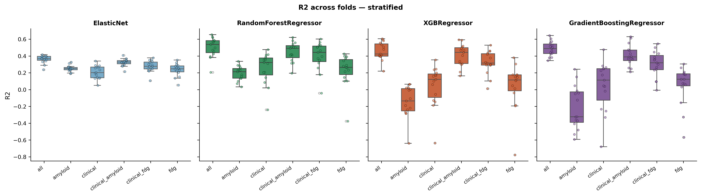

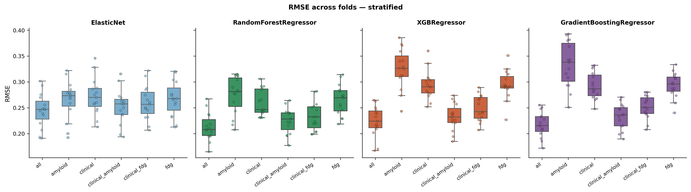

#### Site Generalization (LOSO)

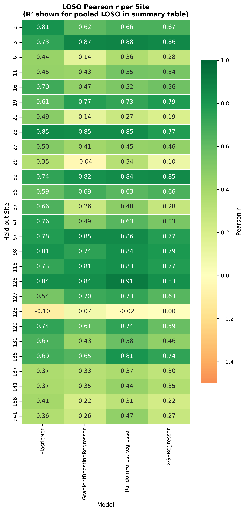

#### Predicted vs Actual TAU_SUVR. Best Model (Random Forest)

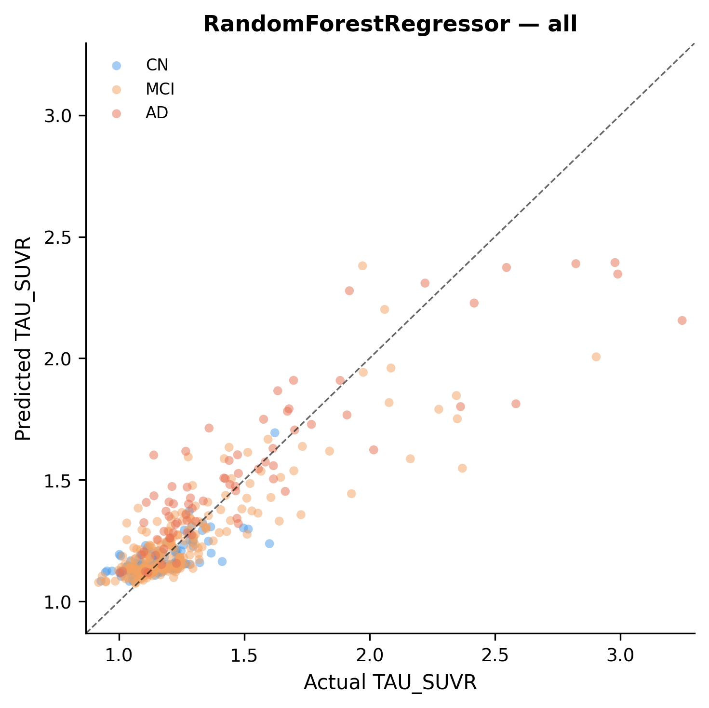

#### Metrics. All Predictor Set (mean ± SD across 15 CV folds)

| Model | R² | RMSE | MAE | Pearson r | Spearman ρ |
|---|---|---|---|---|---|
| **Random Forest** | **0.504 ± 0.119** | **0.213 ± 0.027** | **0.125 ± 0.010** | **0.723 ± 0.070** | **0.608 ± 0.061** |
| Gradient Boosting | 0.485 ± 0.087 | 0.218 ± 0.024 | 0.131 ± 0.012 | 0.710 ± 0.058 | 0.581 ± 0.074 |
| XGBoost | 0.457 ± 0.107 | 0.224 ± 0.029 | 0.135 ± 0.012 | 0.687 ± 0.068 | 0.578 ± 0.065 |
| ElasticNet | 0.361 ± 0.048 | 0.245 ± 0.033 | 0.143 ± 0.012 | 0.644 ± 0.041 | 0.540 ± 0.062 |

#### Metrics. By Predictor Set (Random Forest)

| Predictor Set | R² | RMSE | Pearson r |
|---|---|---|---|
| **all** | **0.504 ± 0.119** | **0.213 ± 0.027** | **0.723 ± 0.070** |
| clinical_amyloid | 0.448 ± 0.117 | 0.225 ± 0.024 | 0.681 ± 0.080 |
| clinical_fdg | 0.398 ± 0.170 | 0.233 ± 0.028 | 0.650 ± 0.110 |
| clinical | 0.255 ± 0.190 | 0.260 ± 0.026 | 0.548 ± 0.130 |
| fdg | 0.229 ± 0.196 | 0.265 ± 0.029 | 0.520 ± 0.106 |
| amyloid | 0.193 ± 0.087 | 0.275 ± 0.036 | 0.480 ± 0.063 |

> **Key finding:** Amyloid PET provides the largest individual improvement over clinical features alone, but a model with ALL clinical, amyloid and PET predictors performs better than models with single or dual markers. Tree-based models outperform ElasticNet and other models.

---

### Binary Outcome. Tau+/Tau− Classification

#### Performance Across Models

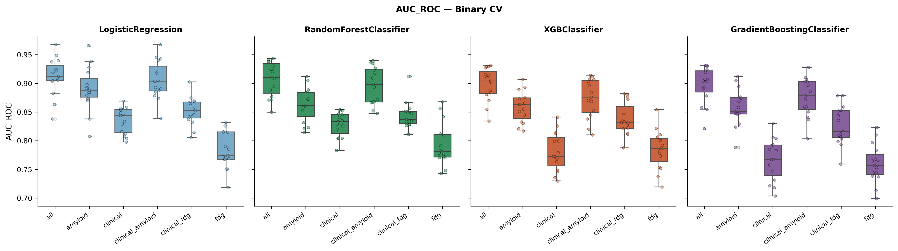

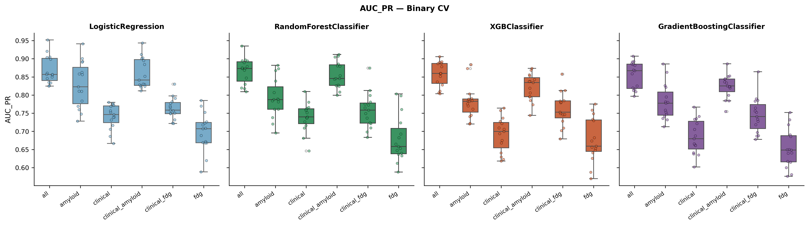

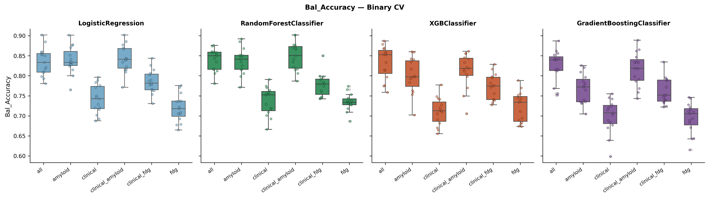

#### ROC Curves and Calibration

<p float="left">
  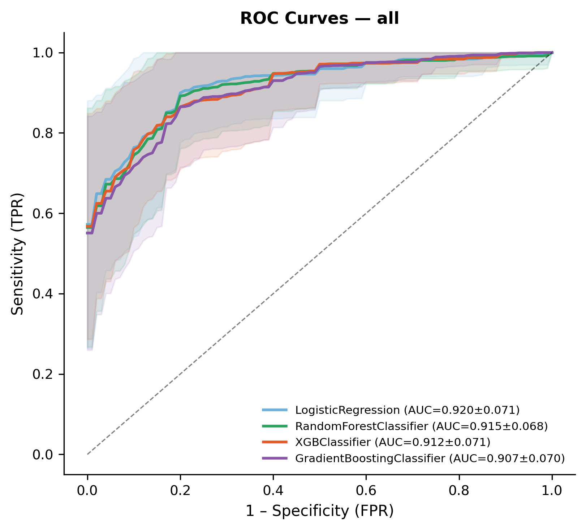
  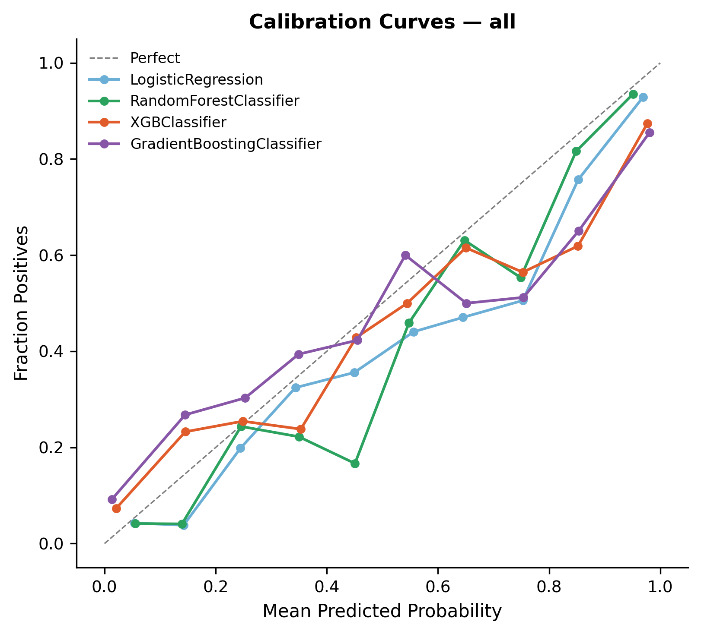
</p>

#### Metrics. All Predictor Set (mean ± SD, threshold = 0.445)

| Model | AUC-ROC | AUC-PR | Bal. Acc. | Sensitivity | Specificity | F1 | Brier |
|---|---|---|---|---|---|---|---|
| **Logistic Regression** | **0.912 ± 0.033** | **0.868 ± 0.038** | **0.835 ± 0.035** | 0.838 ± 0.064 | 0.831 ± 0.031 | **0.783 ± 0.039** | **0.116 ± 0.020** |
| Random Forest | 0.907 ± 0.030 | 0.867 ± 0.035 | 0.840 ± 0.028 | 0.856 ± 0.050 | 0.824 ± 0.032 | 0.789 ± 0.032 | 0.117 ± 0.018 |
| XGBoost | 0.898 ± 0.029 | 0.857 ± 0.034 | 0.833 ± 0.041 | 0.808 ± 0.071 | 0.857 ± 0.047 | 0.783 ± 0.049 | 0.128 ± 0.027 |
| Gradient Boosting | 0.897 ± 0.032 | 0.855 ± 0.037 | 0.824 ± 0.039 | 0.779 ± 0.066 | 0.868 ± 0.044 | 0.774 ± 0.049 | 0.134 ± 0.029 |

#### Metrics. By Predictor Set (Logistic Regression)

| Predictor Set | AUC-ROC | AUC-PR | Bal. Acc. | Sensitivity | Specificity |
|---|---|---|---|---|---|
| **all** | **0.912 ± 0.033** | **0.868 ± 0.038** | 0.835 ± 0.035 | 0.838 ± 0.064 | 0.831 ± 0.031 |
| clinical_amyloid | 0.906 ± 0.033 | 0.860 ± 0.042 | **0.842 ± 0.034** | 0.856 ± 0.059 | 0.829 ± 0.041 |
| amyloid | 0.890 ± 0.039 | 0.829 ± 0.063 | 0.839 ± 0.034 | **0.838 ± 0.060** | **0.839 ± 0.028** |
| clinical_fdg | 0.852 ± 0.025 | 0.763 ± 0.029 | 0.786 ± 0.029 | 0.785 ± 0.057 | 0.786 ± 0.052 |
| clinical | 0.835 ± 0.023 | 0.741 ± 0.034 | 0.741 ± 0.036 | 0.746 ± 0.061 | 0.737 ± 0.042 |
| fdg | 0.783 ± 0.032 | 0.698 ± 0.053 | 0.719 ± 0.034 | 0.728 ± 0.058 | 0.710 ± 0.069 |

> **Key finding:** Logistic Regression outperforms tree-based models (AUC-ROC 0.912), with maybe suggests that the tau+/tau− decision boundary is mainly linear. Amyloid alone achieves AUC-ROC 0.890: the strongest single predictor of tau positivity.

---

### Feature Importance (SHAP)

<p float="left">
  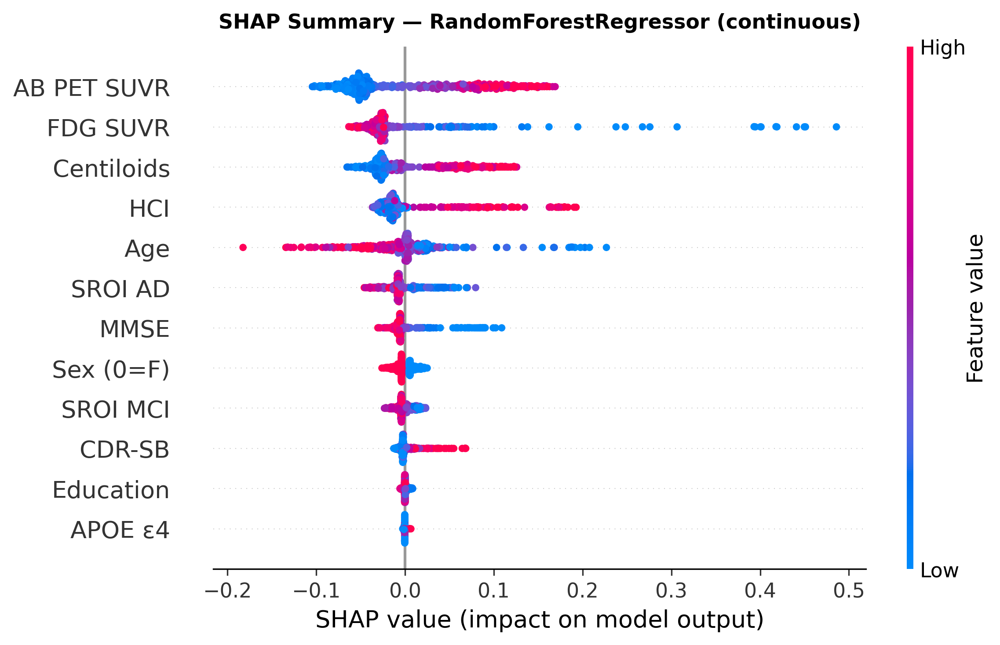
  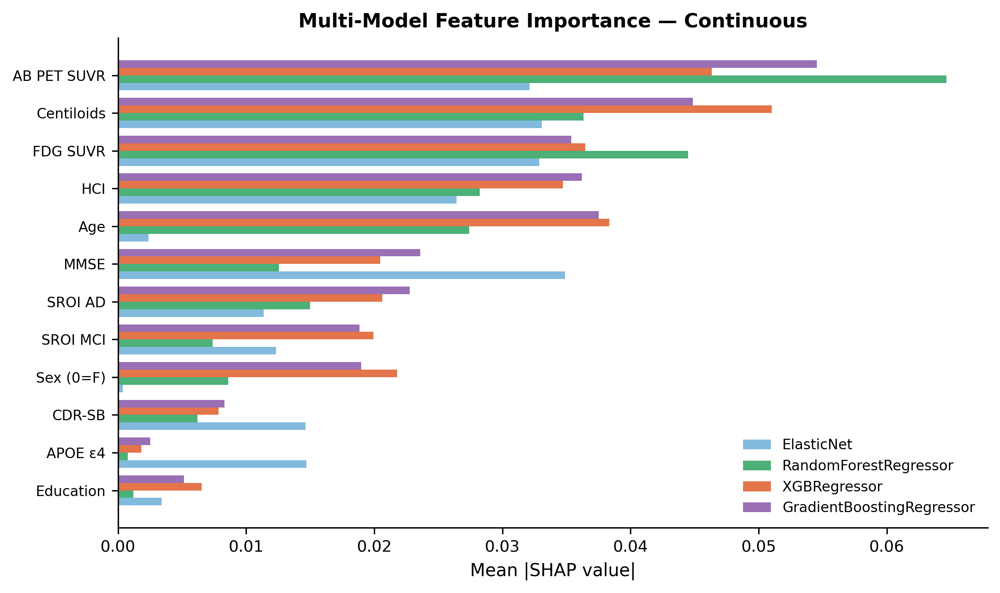
</p>

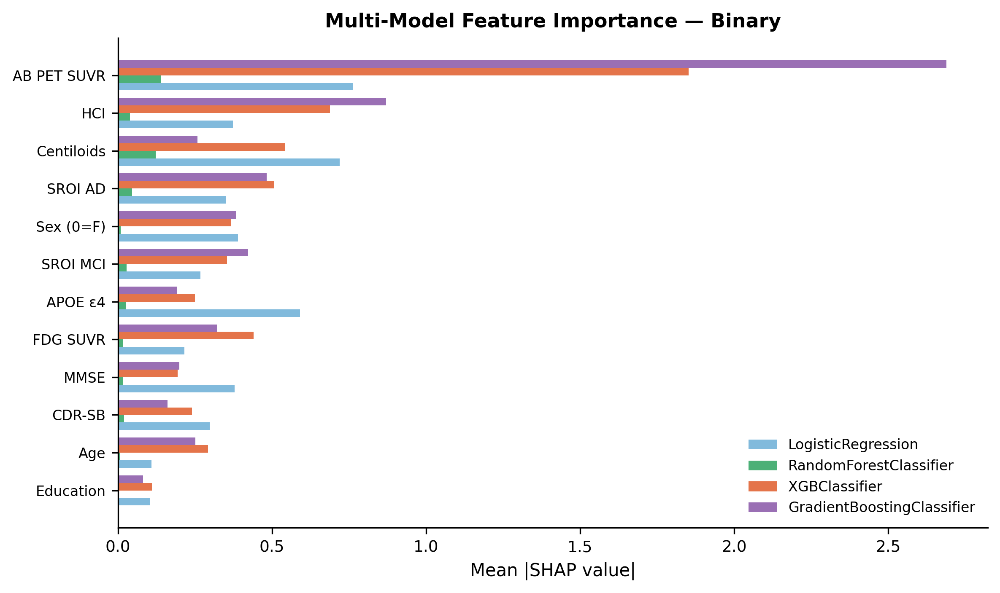

---

### Brain Visualization

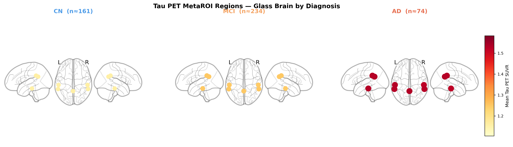

---

## Skills I Learned

- **Machine Learning**: regression and classification pipelines, hyperparameter configuration, model comparison, handling class imbalance
- **Cross-Validation**: stratified K-Fold, repeated C, Leave-One-Site-Out for multi-site generalization
- **Model Explainability**: SHAP values, multi-model feature importance comparison
- **Clinical Metrics**: AUC-ROC, AUC-PR, balanced accuracy, sensitivity, specificity, PPV, NPV, calibration curves
- **Neuroimaging**: tau PET MetaROI computation, nilearn brain visualization
- **Open Science**: synthetic data generation, GitHub reproducibility
- **Python**: scikit-learn pipelines, XGBoost, SHAP, nilearn, pandas

---

## Conclusion

This project shows that tau PET burden and positivity can be predicted from multimodal biomarker data with clinically meaningful accuracy. The comparison of predictor sets shows the contribution of clinical, amyloid, and FDG predictors. LOSO cross-validation might confirm site generalizability. SHAP analysis provides interpretable insights into which biomarkers have the strongest power in predictions. The full pipeline is reproducible by anyone via the included synthetic dataset. I learned A LOT about machine learning and kept making mistakes, but everything turned out ok by the end. Next step: actual PET/MRI images as predictors???

---

## Repository Structure

```
├── config.yaml                  
├── requirements.txt
├── run_all.sh                   
├── Makefile
├── data/         
│   └── synthetic/
│       └── synthetic_dataset.csv 
├── src/
│   ├── utils.py
│   ├── 00_data_prep.py
│   ├── 01_generate_synthetic.py
│   ├── 02_ml_continuous.py
│   ├── 03_ml_binary.py
│   ├── 04_shap_analysis.py
│   └── 05_brain_render.py
└── results/
    ├── figures/
    
```

---

## How To Use

```bash
# 1. Clone
git clone git@github.com:brainhack-school2026/Rodriguez_project.git
cd Rodriguez_project

# 2. Set up a virtual environment

#For Linux/Mac:
python -m venv .venv
source .venv/bin/activate

#For Windows:
python -m venv .venv
.venv\Scripts\activate

# 3. Install
pip install -r requirements.txt

# 4. Run full pipeline on synthetic data (IMPORTANT: you won't run the 01_generate_synthetic.py nor the 05_brain_render.py scripts)
bash run_all.sh

# Results in results/figures/ and results/tables/
```

**With the real ADNI data:**
```bash
bash run_all.sh --real \
  --merged  /path/to/merged_data.csv \
  --visual  /path/to/visual_reads.csv
```

**If you want to generate synthetic data from your real data (run once only):**
```bash
python src/01_generate_synthetic.py --mode from_real \
  --merged      /path/to/merged_data.csv \
  --visual_reads /path/to/visual_reads.csv
```
---

## References

Jack CR Jr, et al. The Alzheimer's Disease Neuroimaging Initiative (ADNI): MRI methods. *J Magn Reson Imaging*. 2008.
